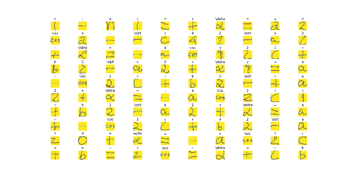

# HandWritingRecognition
Spring 2019 CS 687 Capstone Project

Progress Report
Hand-written Mathematical Formula Recognition Using Machine Learning

Chithiraikkayalvizhi Chinnusami

Advisor:  Sion Yoon

MS in Computer Science
Technology Institute

City University of Seattle

chinnusami.chithirai@cityuniversity.edu, yoonhee@cityu.edu

**Abstract**

In this project, we will explore the field of hand-written mathematical formula recognition. We&#39;ll try to solve the problem using machine learning, relying heavily on the Tensorflow machine learning toolkit. We&#39;ll start with simple formulas with linear structure and iteratively build systems to recognize more complex formulas involving sub-script and super-script symbols. The project will prototype a sample App that will take input either from a stylus from a phone camera and pass the raw input to the recognition engine and output the formula in a standard format like Latex.

**Keywords:** Handwriting recognition, Mathematical Symbol Recognition, Formula Recognition, Machine Learning, Artificial Intelligence, Tensorflow, InkML, CROHME, Optical Character Recognition (OCR)


**1. INTRODUCTION**

Hand-written digit and alphabet detection have been a well-understood problem. With known solutions having human-like accuracy. However, there are not many mature systems that do well beyond the 10 digits and 26 alphabetic characters. The goal of this project is to develop a machine learning model to extend the existing hand-written recognition systems to include mathematical symbols. And be able to develop a system that could detect and solve mathematical formulae.

**Problem Statement**

Given a formula with its corresponding stroke data, the goal if this project is to develop a system that will identify the formula and output the result in a standard text format like Latex, MathML, etc. An alternative input for the system could be an image representation of the formula. Since Stroke data could be converted to an image and since stroke data is richer than the image data, we&#39;ll focus primarily on stroke data while we also assess the system&#39;s performance on image data as well.


**Motivation**

From this project, I hope to learn valuable skills that would require dealing with real-world raw data and the process to develop intelligent systems that were trained with these datasets. I feel that the knowledge acquired with completing this project will be very valuable in pursuing my career as a Data Scientist.

**Approach**

This project will use the CROHME (Competition on Recognition of Online Handwritten Mathematical Expressions) dataset as an initial starting point and use the provided training symbols as the raw data to train the recognition model. The project will focus on scrubbing the data and modifying the raw data to the necessary format optimal for machine learning and analyze the performance of various machine learning models. The performance will be validated against a test data set as well as a validation dataset. Based on the results from experiments, the optimal model will be chosen, and an analysis of its performance will be conducted. The final model performance will be compared to existing solutions, and the project hopes to improve upon the currently existing solutions.

The core of the project will be implemented using the Tensorflow machine learning framework. TensorFlow is a machine learning system that operates at large scale and in heterogeneous environments. TensorFlow abstracts the internal implementation details of the machine learning algorithms so we can focus on tuning the algorithms to suit our problem instead of implementing them from scratch.


**Conclusions**

Two metrics will be calculated using the designed systems and will be compared against existing baseline systems. First, Symbol recognition success rate, which will denote the percentage of symbols successfully recognized in the entire corpus of symbols. We&#39;ll also do a breakdown of the top failed symbols. Second, Formula recognition rate, which will denote the percentage of formulae successfully recognized. We&#39;ll break down this metric into more granular numbers by forming a distribution of formulae with 0,1,2…n errors. We&#39;ll also look at other qualitative measures like the time take to develop and train the models.

**2. BACKGROUND**

The problem to recognize handwriting has been a research topic for several decades. The most well-known dataset in the machine learning community, the MNIST data were collected to solve the problem of recognizing handwriting data. Even though systems have been developed that achieve accuracy of \&gt; 99% on the MNIST data, handwriting recognition for mathematical symbols is still a research topic. For example, CROHME: Competition on recognition of online handwritten mathematical expressions 2016 had systems achieve accuracy of only ~70%. In this project, we&#39;ll try to achieve similar accuracy measures as a baseline. Any higher accuracy rates achieved by the system would be considered a great success for this project.

**CROHME Dataset** : More than 10,000 labeled handwritten formulae publicly available. The training, validation, and test sets are created from this data.

**INKML** : The InkML format enables to make references between the digital ink of the expression, its segmentation into symbols, and its MathML representation. An example of an InkML file for the expression a \&lt; b / c is shown below. It contains 6 strokes for 5 symbols (two for the &#39;a&#39;, and one for each of the other symbols). Note that the traceGroup with identifier xml:id=&quot;8&quot; has references to the 2 corresponding strokes of the symbol &#39;a&#39;, as well as to the MathML part with identifier xml:id=&quot;A&quot;. Thus, the stroke segmentation of a symbol can be linked to its MathML representation.

Example:
```
<ink xmlns="http://www.w3.org/2003/InkML">
<traceFormat>
<channel name="X" type="decimal"/>
<channel name="Y" type="decimal"/>
</traceFormat>
<annotation type="writer">w123</annotation>
<annotation
type="truth">$a<\frac{b}{c}$</annotation>
<annotation type="UI"> 2011_IVC_DEPT_F01_E01
</annotation>
<annotationXML type="truth" encoding =
"Content-MathML">
<math
xmlns="http://www.w3.org/1998/Math/MathML">
<mrow>
<mi xml:id="A">a</mi>
<mrow>
<mo xml:id="B"><</mo>
<mfrac xml:id="C">
<mi xml:id="D">b</mi>
<mi xml:id="E">c</mi>
</mfrac>
</mrow>
</mrow>
</math>
</annotationXML>
<trace id="1">985 3317, ..., 1019 3340</trace>
...
<trace id="6">1123 3308, ..., 1127 3365</trace>
<traceGroup xml:id="7">
<annotation type="truth">Ground
truth</annotation>
<traceGroup xml:id="8">
<annotation type="truth">a</annotation>
<annotationXML href="A"/>
<traceView traceDataRef="1"/>
<traceView traceDataRef="2"/>
</traceGroup>
...
</traceGroup>
</ink>

```

**Tensorflow:** TensorFlow is a machine learning system that operates at large scale and in heterogeneous environments.

**Convolutional Neural Networks (CNNs):** A CNN is a regularized version of a multilayer perceptron (MLP). CNNs have shown very good performance with image classification and therefore are the first choice for the task.

**Keras:** Keras is an open-source neural-network library written in Python. It is capable of running on top of TensorFlow. It acts and an interface using the user can author complex Neural Networks (NN) with ease, as the Keras APIs abstract the implementation details from the user and the user only focusses on the model definition.

**3. RELATED WORK**

The systems that participated in the original CROHME competitions will serve as our baseline systems to compare our results against. However, we&#39;ll refer to two other systems as well. These systems are explained in detail in (Lu, C., et al. 2015) and (Zhang, J., et al. 2017) and we&#39;ll use some of the methods especially related to input data formatting and massaging in our systems as well.

Like all machine learning projects, this project will also require good training and test data to create machine learning models. CROHME has been collecting the data by various methods and has this data available in a W3C standard format (InkML). We&#39;ll use this data as-is as our raw input data. However, we&#39;ll process the data in the right format as per the needs of our ML framework. There are two possible ways we could feed the input to the ML system. First, as stroke data, this is a very rich data as it stores information regarding the way in which the user wrote the symbol. For example, if the user wrote an x the data would contain the number of strokes from the stylus along with the path followed for each stroke. Example: Fig 1. blue dot indicated the starting point of the stroke, and the red dot indicated the endpoint of the stroke. Since stroke data is richer, there is a possibility to achieve more accurate models with smaller training data. However, it could misclassify symbols if the user has an unconventional writing style. For example, left-handed people could have variations in stroke data, and the data may not be sufficient to reach high accuracy on existing data. The other main issue with stroke data is that it cannot be generated when we are using the camera as input. Hence, we&#39;ll consider the other form of input for the training data, converting the stroke data to an image, and training an optical character recognition (OCR). With an OCR based system, we may have to train with data that is less rich than the stroke data. Hence, we&#39;ll try sample systems with both models and decide based on the performance of these systems.


Fig 1. Sample Inkml Symbol

Based on the existing literature, we&#39;ll break down the problem into two sub-tasks. First, Symbol recognition which will be a system that focuses solely on the recognition of individual symbols. This leg of the problem will take the strokes data for a single symbol from the entire formula as input and will classify the given symbol into one of the known symbols. Second, structure recognition which will be an independent system that takes the strokes data of an entire formula and segment the formula into multiple stroke data for its individual symbols. The structure recognition system will output an array of individual symbols in InkML format along with the relation between the symbols if applicable. This array of symbols will be fed to the symbol recognition system, and the symbols will be identified. The identified symbols, along with the relationships among the symbols, will be used to generate the formula in a known format like Latex. Higher priority will be given to the symbol recognition system as we can use simple heuristics to solve structure recognition. For example, simple equations can be segmented by looking for empty spaces between the individual symbols in the provided input data. We can iteratively improve the structure recognition system to expand the list of supported formula.

**4. APPROACH**

We&#39;ll use an iterative approach to build the systems and subsystems. We&#39;ll start with a quick and trivial implementation. Evaluate the performance and make improvements as required. The focus of the project will not be in trying to implement niche machine learning algorithms but instead to leverage the framework to its fullest capacity and put together a system that would compete and/or exceed the baseline performances set previously.

**5. DATA COLLECTION**

Two datasets are used for this project. The CROHME2016 dataset along with the CROHME2019 dataset. The CROHME2019 dataset is an incremented version of the 2016 dataset. However, we&#39;ll keep distinct copies of these datasets because no baseline metrics are available for systems using the 2019 dataset, due to the results of the 2019 competition not being publicly available at the moment. This is not a major issue as the 2016 dataset is only about ~230 MBs in size. We&#39;ll use the 2016 data to create models and compare against the existing baseline systems to get a more accurate comparison of the systems involved. We&#39;ll use the models developed with the 2019 dataset to assess the improvement to the system on additional data. This could also give us an insight into how our model performs on incremented data and could help us decide if getting further data with alternate methods could improve the method further. The data sets are publicly available to download online.

The first issue to tackle was with the organization of data. Though the data was easily available to download, the manner in which the data was organized by default was not optimal. There were cases where the same data was stored in multiple ways, for example, the two copies of the formula data were stored one with ground-truth value embedded in the InkML and on where the ground truth values in a flat-file. We decided to save only one copy of the data with the ground-truth embedded in the InkML. This results in a nice format where each file in our filtered dataset will represent one unique data point. Table 1 below lists the counts of data points available for each different type of stroke data.

Once the ground-truth flat files were removed and all the ground truth data was embedded into the InkML files, the file names were renamed to a simpler format. Each data point will be represented in the format &quot;\&lt;id\&gt;.inkml&quot;. This id is not globally unique but will be unique to the folder. For example, all the formula InkML will have the filenames from 0.inkml, 1.inkml, ... 1146.inkml. Going with a simpler file naming system helps us to easily refer to a single file or a range of files with ease from our scripts. This was not possible initially with the original naming convention followed in the source dataset.

Further data cleansing operations were required for this dataset. These steps are described in detail in the next section.

**6. DATA ANALYSIS**

A summary of the number of data points is listed in Table 1.

|   | **Dataset Size** | **Unique data points** |
| --- | --- | --- |
| **Formula Data** | 9.45 MB | 1147 |
| **Symbols Data** | 239 MB | 191025 |

Table 1. Data Summary

Each data point for symbol data is further sub-divided into three non-overlapping sets: Training set, Test set, and Validation set. These data sets have been split into the source data itself. Since one of our tasks is to compare our developed System performance against baseline system performance, we&#39;ll use these three sets as-is without making any modifications. Formula data, however, are not split into training, test, and validation sets. All the formula data will be used to validate the system performance and will not be used for symbol recognition. However, the formula dataset will still be split into training, test, and validation set for the structure recognition system if necessary. Table 2 provides a summary of the data split into the various datasets.

|   | **Formula Data** | **Symbols Data** |
| --- | --- | --- |
| **Training Set** | 0 | 160086 |
| **Test Set** | 0 | 18435 |
| **Validation Set** | 1147 | 12504 |
| **Total** | 1147 | 191025 |

Table 2. Dataset summary

Table 3 displays the counts of the top 10 symbols in the dataset.

| **Symbols** | **Count** |
| --- | --- |
| - | 9290 |
| 1 | 7254 |
| 2 | 7248 |
| + | 6299 |
| x | 6251 |
| ( | 4697 |
| ) | 4692 |
| = | 4364 |
| a | 3244 |
| 3 | 2864 |

Table 3. Top 10 Symbols in the dataset

**Data Cleansing:**

Several issues were found with the dataset and required a script to be written to fix.

xml: id issue: The inkml files had an xml:id attribute, which as per the XML namespace specification cannot be an integer. This issue was preventing the file from being parsed as an XML object. It was decided to rename the attribute value to id as opposed to xml:id.

non-unique id attributes: The id attributes within an InkML file in some cases were non-unique. This issue was resolved by regenerating the id values again in the offending files.

XML namespace issue: Erroneous namespace value was provided to the root XML element, which has to be corrected for all data points.

Redundant nesting: The \&lt;traceGroup\&gt; attribute had redundant nested elements. For easier processing, the redundant nested elements were flattened.

Sample Nested element:
```
<traceGroup>
 <traceGroup id="0">
   <annotationtype="truth"></annotation>
   <traceView traceDataRef="13"/>
 </traceGroup>
</traceGroup>
```
After Processing: 
```
<traceGroup id="0">
   <annotationtype="truth"></annotation>
   <traceView traceDataRef="13"/>
</traceGroup>
```

**Data Staging:**

Once the data issues were resolved and all the data cleansing steps complete, the data was loaded into a MongoDB database. This will help us retrieving selective data faster and easier as MongoDB takes care of creating indexes for the entire dataset resulting in faster query times. It is easier because the database abstracts the internal storage details and provides simple APIs to retrieve the required data.

The addition of the dataset to MongoDB also helps us to prune erroneous data in training and test dataset by performing a soft delete without actually deleting the files. Implementing this is non- trivial and inefficient with dataset in flat files.


Fig 2. View of Datasets modeled as MongoDB documents


Fig 3. Indexes on dataset

**Machine Learning Models:**

We use the Keras framework to architect CNN. The framework handles the internal details of the implementation of the NN and we just have to specify the high-level architecture.


Fig 4. Code snippet defining  a CNN using Keras APIs

The code snippet in fig 4. Results in the following CNN (fig 5). In this example, the trace data was processed into an array of dimension (50x50). We will define models that take input in smaller or larger dimensions and will evaluate and compare the results in these scenarios.


Fig 5. Sample CNN architecture generated using Keras APIs

We use Tensorflow as the backend for Keras. Keras APIs will generate the CNN model and will run these models in  TensorFlow.

The trained models generated were saved back into MongoDB in a separate collection. As training, the data is very compute-intensive and could take hours if not days, and the optimal tuned model is obtained through iteration. We decided to save the trained model and its performance metrics in the database as this allows us to analyze the parameters that provided us optimal results at a later time.

Keras Version: 2.2.4

Tensorflow Version:  1.14.0

GPU vs CPU: We trained the model on both CPU as well as GPU to compare their respective performances. This is analyzed in detail in the next section.

**7. FINDING**

**Dataset:**

We used matplotlib to view the provided datasets(Fig 6). This gave us some insights into the quality of the data. From a quick look, we found discrepancies in the training data(fig 7 circled in red). Though the model was robust to handle these outliers due to the large dataset size (5042 training samples for x), it was however not the case for symbols less represented in the training data.

Fig 6. A random sample of training symbols


Fig 7. Erroneous symbols in training data

**Model Generation:**

The generation of the model requires training the model on the training dataset. This is a very compute-intensive task. Two options were tried our and compared. First, to train the model with CPU and the other was to train the model on GPU. An Intel Core i7 4710MQ CPU was used to benchmark the CPU performance while an NVIDIA GeForce GTX 880M was used to benchmark the GPU performance. The performance was measured over 20 epochs. The GPU took about 975us to take a step (975 us/step) while it took the CPU 8ms to take a single step. The best epoch time for the GPU was 84s to complete a single epoch a CPU took about 661s. That is a speedup of 7.87x.

**Model Performance:**

Simple 1-Layer CNN:

The performance was tested per epoch on the validation set and finally with the test dataset after all epochs were completed. It was observed that the baseline performance on CNN fell flat once reaching ~80%. Plotting the performance curves over the training period it is clear that the model is having an issue generalizing and is overfitting the data after about 5 epochs. This is clearly visible due to the fact that the loss function in the test set starts flattening between 5-8 epochs and starts rapidly increasing from there onwards (Fig 8). All this while the model accuracy flattens at around 80% (Fig 9).


Fig 8. Model loss over time


Fig 9. Model accuracy over time

Deep n-layer CNN:

Multiple hyperparameters for the 1-layer CNN were tuned to improve accuracy. These parameters include the kernel size, the pooling size, dropout rates and the number of hidden layers. Based on trial and error optimal values were discovered for each hyperparameter. The results of the tests were serialized to a standard format and stored in MongoDB for future offline analysis. This could be helpful to further tune the model or get insights into how the hyperparameters influence the accuracy of the model. However, the accuracy of the model did not increase above ~81% with extensive tuning.

To improve the model further the CNN was extended with multiple convolution layers. This significantly improved performance to ~88%. The multi-layer network improves performance by scanning the images with multiple filters. With each filter capturing different aspects of the handwritten data. For example a larger filter (13x13) would capture broad stroke information while a smaller filter (5x5) would capture finer detail like small curves. The multi-layer network would consider both the larger details as well as the smaller details and, hence improving the accuracy. This performance of 88% (Fig 11.) is comparable to the baseline system performances. We can also see that the model is not overfitting and is generalizing better than the 1-Layer CNN (Fig 12.).  Further tuning of parameters in the multi-layer model would yield significantly higher accuracy.


Fig 10. Multi-layer CNN


Fig 11. Model accuracy over time (3-Layer CNN)


Fig 12. Model loss over time

**Formula Segmentation:**

We use the OpenCV contour extraction APIs to segment the formulae. Using this method we could detect more complex structural relationships between the symbols of a formula. However, the current design assumes a linear structure. The ability handle complex structural relations like subscript and superscript can be iteratively added to the system with incremental change in accuracy and without degrading the system&#39;s current detection accuracy.

**8. CONCLUSION**

Based on the above results we have been able to develop a system to detect handwritten mathematical symbols, end-to-end, which performs at an acceptable level of accuracy compared to the existing baseline systems. The system generated above was developed with existing opensource tool and trained on commercial hardware with acceptable training and test performance. Further improvements to the system are listed out per component in the section below.

**9. FUTURE WORK**

**Symbol Recognition:**

There is further scope to improve the performance of symbol recognition. Due to lack of compute resources and extensive time for training, it was time-consuming searching for the optimal NN architecture as well as properly tuned hyperparameters. With more complex architecture and tuning we believe it is possible to improve performance up to ~95%.

Further improvements can be made to the predictions by suggesting multiple predictions to the user. For example, x and \times are usually indistinguishable and depends on the context. In such scenarios instead of predicting a single value having a probability of success of 50% on average, the system could predict 2 symbols and could provide a simple interface for the user to choose any of the options. This could help improve the system accuracy in scenarios where an active user is present.

**Formula segmentation:**

Current segmentation implementation is trivial and assumes a linear structure of the formula. This prevents the recognition of a wide variety of symbols. For example, the system currently cannot detect any polynomial equations. More complex segmentation could be developed that can handle features like superscripts, subscripts, square roots, etc.

**Demo tool:**

A live demo tool would be very useful in trying out more user input and test the performance on a dynamic test set. All the tests have been performed on a fixed test set. Due to the size and random selection of the test set, we assume it will be a good representation of real-world data. But an ideal test of the model would be a small tool that could be distributed to users and also establish a feedback loop to improve the system performance further.

**10. REFERENCE**

Mouchère, H., Viard-Gaudin, C., Zanibbi, R., &amp; Garain, U. (2016, October). ICFHR2016 CROHME: Competition on recognition of online handwritten mathematical expressions. In 2016 15th International Conference on Frontiers in Handwriting Recognition (ICFHR) (pp. 607-612). IEEE.

Y.-M. Chee, M. Froumentin, and S. M. Watt (editors). Ink

Markup Language (InkML), September 2011. [http://www.w3.org/TR/InkML/](http://www.w3.org/TR/InkML/).

R. Zanibbi, H. Mouchere, and C. Viard-Gaudin (2013) Evaluating Structural Pattern Recognition for Handwritten Math via Primitive Label Graphs. Proc. Document Recognition and Retrieval, Proc. SPIE vol. 8658, pp. 17-1 - 17-11, San Francisco, CA.

Ion, P., Miner, R., Buswell, S., &amp; Devitt, A. D. (1998). Mathematical Markup Language (MathML) 1.0 Specification. World Wide Web Consortium (W3C).

Zanibbi, R., &amp; Blostein, D. (2012). Recognition and retrieval of mathematical expressions. International Journal on Document Analysis and Recognition (IJDAR), 15(4), 331-357.

Lu, C., &amp; Mohan, K. (2015). Recognition of Online Handwritten Mathematical Expressions Using Convolutional Neural Networks.

Zhang, J., Du, J., Zhang, S., Liu, D., Hu, Y., Hu, J., ... &amp; Dai, L. (2017). Watch, attend and parse: An end-to-end neural network based approach to handwritten mathematical expression recognition. Pattern Recognition, 71, 196-206.

Abadi, M., Barham, P., Chen, J., Chen, Z., Davis, A., Dean, J., ... &amp; Kudlur, M. (2016). TensorFlow: A system for large-scale machine learning. In 12th {USENIX} Symposium on Operating Systems Design and Implementation ({OSDI} 16) (pp. 265-283).

Géron, A. (2017). Hands-on machine learning with Scikit-Learn and TensorFlow: concepts, tools, and techniques to build intelligent systems. &quot; O&#39;Reilly Media, Inc.&quot;.

Zaccone, G., Karim, M. R., &amp; Menshawy, A. (2017). Deep Learning with TensorFlow. Packt Publishing Ltd.

Wongsuphasawat, K., Smilkov, D., Wexler, J., Wilson, J., Mane, D., Fritz, D., ... &amp; Wattenberg, M. (2017). Visualizing dataflow graphs of deep learning models in TensorFlow. IEEE transactions on visualization and computer graphics, 24(1), 1-12.

Smilkov, D., Carter, S., Sculley, D., Viégas, F. B., &amp; Wattenberg, M. (2017). Direct-manipulation visualization of deep networks. arXiv preprint arXiv:1708.03788.

Ion, P., Miner, R., Buswell, S., &amp; Devitt, A. (1998). Mathematical Markup Language (MathML) 1.0 Specification. World Wide Web Consortium (W3C).

Brahmbhatt, S. (2013). Practical OpenCV. Apress.
